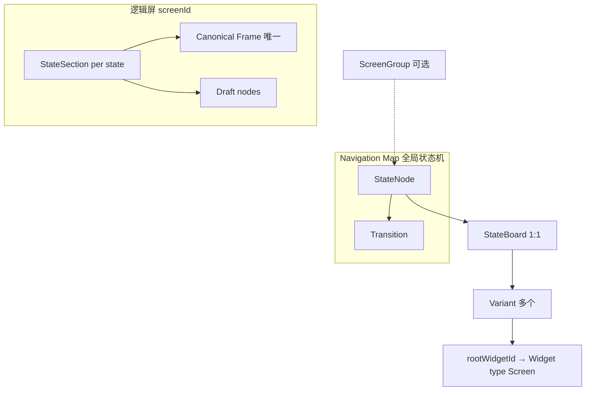

# SpareCircle 产品术语 Wiki

面向**人类协作者**与 **AI 代理**的共享词汇表。本文与 `dev-plan/interaction-design-framework/`、`guidelines/` 及 `src/app/backend/types/` 中的实现保持一致；若实现迭代，以类型定义与 parser 不变量为准。

---

## 2. 架构鸟瞰（v1 与 v2）

- **v1 `ProjectSnapshot`**：以 `screens[]` + `activeScreenId` 为顶，每块屏一棵 widget 树（`widgetsById` 归一化存储）。适合单屏流，但不是「全局 UI 状态机」模型。
- **v2 `ProjectSnapshotV2`**：以 **`navigationMap`（状态机图）** 为顶，每个逻辑状态对应 **`StateBoard` + Variants + 共享 `widgetsById`**。旧屏数据经迁移进入 v2（见 `dev-plan` 中 migration 说明）。

下文默认描述 **v2**，除非特别标注 v1。

---

## 3. 核心术语

### 3.1 Screen（屏 / 逻辑屏 / `screenId`）

**产品含义**：多屏产品中的「一块物理或逻辑显示屏」对应的数据边界，用于 **树隔离** 与 **导出分组**。在口语里也可以把 **「这一块屏上的全部 UI 状态与转移」** 看成该屏的 **顶层状态语境**（与全局 Navigation Map 一起描述整机行为）。

**实现要点**：

- v2 中 `screenId` 由 `StateNode` 推导：`screenGroupId` 若存在则用组 id，否则回退为 **该 StateNode 自身 id**（见 `getScreenIdForStateNode`）。
- **不要**与 Widget 类型里的 **`Screen`**（一种节点类型，作 Variant 根）混淆：后者是画布节点，前者是项目级隔离键。

**与状态机模型的关系**：**整张应用**的全局转移图由 **`NavigationMap`**（`StateNode` + `Transition`）承载；**`screenId`** 负责把 states / widget 树划到「哪一块屏」，使 **多屏编辑互不污染**。二者关系是：**全局一张导航图**，**按屏切片隔离数据**。

---

### 3.2 StateNode（导航图上的「状态」）

**产品含义**：**Navigation Map** 上的一个节点，表示应用 UI 的一个 **顶层设计状态**（可与转移边共同构成状态机）。

**实现**：`StateNode`（`types/navigationMap.ts`），与 `StateBoard` **1:1**（`boardId`）。字段包括 `position`、`isNavigationState`（是否在顶层图中突出显示）、可选 `screenGroupId`（归属哪一逻辑屏组）。

**口语中的 “state”**：在编辑器里常指 **StateNode**，或指其对应 **StateBoard** 下的编辑上下文，需根据上下文区分。

---

### 3.3 StateBoard（状态画板）

**产品含义**：某个 **StateNode** 专属的内部设计面：管理 **多个 Variant**（一套方案分支）及画板元数据（尺寸、背景等）。

**实现**：`StateBoard`（`types/stateBoard.ts`），含 `variantIds`、`canonicalVariantId`（必须属于 `variantIds`）。

---

### 3.4 Variant（变体 / 方案分支）

**产品含义**：同一 State 下的一种 **界面方案**；其中 **Canonical** 变体是导出的主方案，其余可为 draft/archived。

**实现**：`Variant`（`types/variant.ts`），`rootWidgetId` 指向 `widgetsById` 中 **`type === "Screen"` 且 `parentId === null`** 的根节点（沿用旧渲染/导出管线，见 INV-4）。

**与「Frame」的关系**：根节点在类型上仍是 **Widget `Screen`**，在 Figma 心智下可理解为 **该 Variant 的根 Frame**。

---

### 3.5 State（左栏 / 某屏下的多个 states）与 StateSection / Canonical Frame（T5 模型）

以下对应 **Widget Edit Canvas** 与 **StateSection** 能力规划（见 `dev-plan/T5_widget-section-canonical-frame-3-agent-plan.md` 与 `types/projectV2.ts` 中 `Section`，后续命名建议迁移为 `StateSection`）。

| 术语 | 含义 |
| --- | --- |
| **State**（左栏列表） | 在 **当前选中的逻辑 Screen（`screenId`）** 下，可存在 **多个** 编辑用状态；与 **StateNode** 一一对应产生 **StateSection**（规划：`state → stateSection` 1:1）。 |
| **StateSection** | 与一个 screen state 绑定的 **工作区容器**：挂 **唯一 Canonical Frame** 与若干 **Draft Frame**。 |
| **Canonical Frame** | 某个 **StateSection** 内 **唯一** 绑定的、**参与导出** 的 **Screen 类型** 根 widget（工程上即该 StateSection 的 canonical 根）。同一 StateSection **不能** 绑定第二个 canonical。 |
| **Draft Frame** | StateSection 内非 canonical 的 Screen frame，可编辑、可转正（绑定为 canonical），默认不直接导出。 |

**关系链（目标不变量）**：`n states → n stateSections → n canonical frames`；**多屏数据隔离**：在 Screen A 下的操作不应错误修改 Screen B 的节点树。

**术语使用规则（强制）**：

- 在 Canvas / Hierarchy / 导出语境中，统一使用 **Frame**（Canonical Frame / Draft Frame）。
- `Widget type = "Screen"` 仅是 Frame 的底层承载类型，不作为产品术语单独暴露。
- 在状态机语境中，`Screen` 默认指 `screenId`（逻辑屏边界）或 ScreenGroup 范围，不等于可插入 widget。
- 文档、注释、UI 文案中禁止把 Frame 写成“screen widget”。

---

### 3.6 Navigation Map（导航图）

**产品含义**：**全局 UI 状态机** 的图结构可视化与数据载体：节点为 `StateNode`，有向边为 `Transition`。

**实现**：`NavigationMap`（`types/navigationMap.ts`），含 `initialStateNodeId`、持久化 `viewport` 等。

---

### 3.7 Transition（转移）

**产品含义**：两个 StateNode 之间的 **有向转移**，可关联 **TransitionEventBinding**（把逻辑边落实为具体触发器，如 widget 事件）。

**实现**：`Transition` + `TransitionEventBinding`（`types/navigationMap.ts`、`types/eventBinding.ts`）。

---

### 3.8 ScreenGroup（屏组）

**产品含义**：把多个 StateNode **归并到同一逻辑屏**（共享 `screenId`），用于 Navigation Map 上的分组着色与 **导出时 Screen 命名**（`exportScreenName` 等）。

**实现**：`ScreenGroup`（`types/screenGroup.ts`）。

---

### 3.9 Snapshot（项目快照）

**产品含义**：整个项目在某一时刻的 **冻结副本**（与 Variant 的草案/定稿不是同一概念）。

**实现**：`Snapshot`（`types/snapshot.ts`），存 `ProjectSnapshotCore`，**不**进 undo 栈。

---

### 3.10 Widget 与 WidgetNode

**产品含义**：画布上的 **控件与容器**（Label、Button、Screen 根等）。

**实现**：扁平 `widgetsById`，树关系由 `parentId` / `childrenIds` 表达（见 `guidelines/widget-node-storage-system.md`）。

---

### 3.11 WorkspaceMode / NavigationZoomLevel

- **WorkspaceMode**：`"designer" | "engineer"`，工作区角色偏好。
- **NavigationZoomLevel**：从 **整图（map）** **钻入** 到 **某一 StateBoard + 某一 Variant** 的会话导航层级（`types/mode.ts`、`types/zoomLevel.ts`）。

---

## 4. 易混对照

| 口语 / UI | 更精确的模型名 | 备注 |
| --- | --- | --- |
| 「Screen」 | `screenId` / ScreenGroup / v1 `screens[]` | v2 优先用 `screenId` 与组；v1 的 screen 是另一套列表模型 |
| 「Screen（Widget 类型）」 | Frame 的实现承载类型（`Widget type = "Screen"`） | 工程实现名，不是产品层主术语；产品层统一称 Frame |
| 「State」 | `StateNode` 或左栏「当前屏下的 state」 | 后者与 StateSection 规划对齐时需看 `activeScreenId` 语义 |
| 「Canonical」 | `StateBoard.canonicalVariantId` / StateSection 的 **Canonical Frame** | 前者是 Variant 级；后者是 T5 StateSection 内唯一导出 frame |
| 「根 Frame」 | Variant 的 `rootWidgetId`（类型为 Widget `Screen`） | 与 StateSection canonical 绑定后即为「可导出屏幕 frame」 |

---

## 5. 关系示意（Mermaid）

---

## 6. 实现索引（给 AI）

| 概念 | 优先阅读 |
| --- | --- |
| v2 工程结构 | `dev-plan/interaction-design-framework/00-architecture.md` |
| 核心类型与 INV | `dev-plan/interaction-design-framework/01-data-model.md` |
| `StateSection` 与索引 | `src/app/backend/types/projectV2.ts`、`src/app/backend/stateBoard/sectionModel.ts` |
| StateBoard UI | `guidelines/v2-stateboard-ui-structure.md` |
| Widget 存储 | `guidelines/widget-node-storage-system.md` |

---

## 7. 更新约定

- 术语变更时：同步更新 **本文** 与相关 **`types/` 注释** 或 **dev-plan 数据模型文档**。
- 本文**不**替代 parser 错误信息；校验以 `projectV2Parser` 与各子 parser 为准。

*文档版本：与仓库 2026-Q2 架构一致；`schemaVersion` 以 `CURRENT_PROJECT_SCHEMA_VERSION_V2` 为准。*
